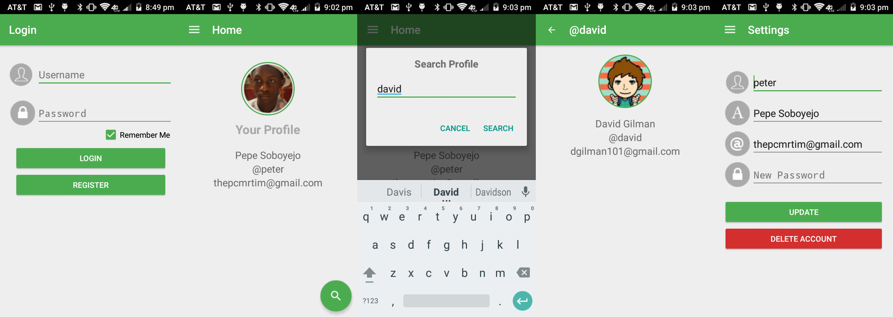

# MobilePassport
Authentication with Passport.js on Mobile
Created by <a href="http://petersoboyejo.com">Peter</a> and <a href="http://ichauster.github.io">Ivan Chau</a> (<a href="https://github.com/dzt/MobilePassport/graphs/contributors">barely</a>).
<br>
Check out the <a href="https://www.youtube.com/watch?v=C4ik82C5G8g">video demo</a>.



# API Reference

| URL | Method | Description | Parameters |
|:-------------------------------:|:------:|:---------------------------------------:|:-----------------------------------:|
| /login | POST | Login as existing user, | username & password |
| /signup | PUT | Register as a new user. | name, username, password, and email |
| /user/search/id/:id | GET | Search For User by ID |  |
| /user/search/username/:username | GET | Search For User by Username |  |
| /user/profile | GET | My Profile for Currently Logged in User |  |
| /user/update | POST | Update As Currently Logged In User | name, username, password, and email |
| /user/delete | DELETE | Delete Currently Logged in User |  |
| /logout | POST | Log Out As Current User |  |

*Note: In order to run the Node.js server you must create a file under the name of `.env` and make sure to add your MongoDB URI.

```

MONGOLAB_URI=< Your MongoDB URI without the "<" and ">" >

```

Install the packages by running
`npm install`

Run the application by typing
`node app.js`

Licensed under the **[MIT License] [license]**.

[license]: https://github.com/dzt/MobilePassport/blob/master/LICENSE
